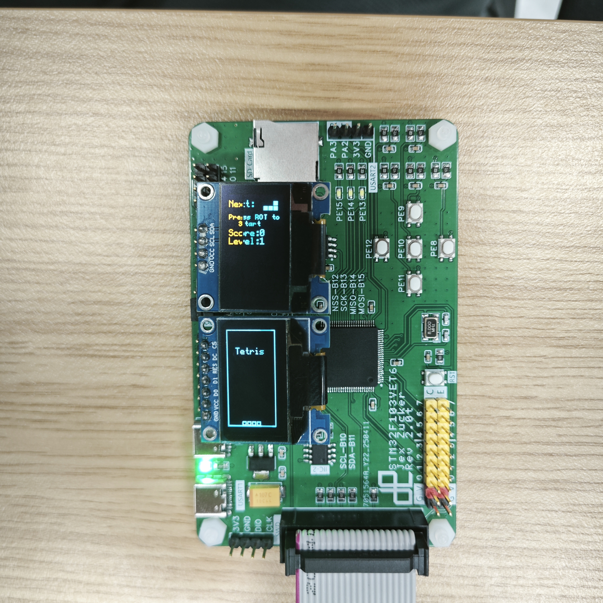

# Arduino Tetris Game

[English](README.md) | [中文](README_zh.md)

A classic Tetris implementation based on Arduino and OLED screens, supporting dual-screen display (game main interface + info panel) and developed using an STM32 board.

## Hardware Requirements

- STM32 development board (e.g., ZLAB_F103VE)
- 128x64 SSD1306 OLED screens x2 (one SPI + one I2C)
- SD Card Module (SPI interface)
- Passive Buzzer
- 5 push buttons
- Connection details:

  ```
  Main screen (SPI):
    CS  -> PA4
    DC  -> PB1
    RES -> PB0

  Info screen (I2C):
    SCL -> PB6
    SDA -> PB7

  SD Card:
    Default SPI pins (MOSI/MISO/SCK/CS)

  Buzzer:
    Signal -> PA8

  Buttons:
    Left   -> PE12
    Right  -> PE8
    Down   -> PE11
    Up     -> PE9
    Rotate -> PE10
  ```

## Software Dependencies

- Arduino IDE or PlatformIO
- U8g2 library (OLED driver)
- STM32SD library (SD Card support)

## Installation Steps

1. Clone this repository.
2. Install the U8g2 and STM32SD libraries (via Arduino Library Manager).
3. Connect the hardware devices.
4. Compile and upload the code to the development board.

## Controls

### Button Functions

- Left/Right: Move horizontally
- Down: Soft drop (accelerated descent)
- Up: Hard drop (instant descent)
- Rotate button: Rotate clockwise
- Press Left + Right simultaneously: Pause, resume with the Rotate button

### Game States

- Splash screen: Press the Rotate button to start
- In-game: Shows the current tetromino and ghost preview
- Pause: Displays PAUSE message
- Game Over: Displays GAME OVER, press Rotate button to retry

## Game Features

- Complete SRS rotation system (supports Wall Kick)
- Ghost piece preview
- Multi-level acceleration system (level up every 10 lines cleared)
- Scoring system:
  - Soft drop: 1 point/line
  - Hard drop: 2 points/line
  - Line clear: 100 points/line × Level
- 7-bag randomizer
- High score saving (to SD card, file `save.txt`)
- Sound effects (Move, Rotate, Drop, Line Clear, Game Over)
- Dual-screen display:
  - Main screen: Game area
  - Info screen: Score/High Score/Level/Next piece

## License

MIT License - Feel free to use, modify, and distribute the code, but please retain the copyright notice.

## Known Limitations

- Hold piece feature not yet implemented
- Level acceleration capped at level 15

Please feel free to submit Issues and Pull Requests!

## Screenshots

### Main Screen


### Info Screen

