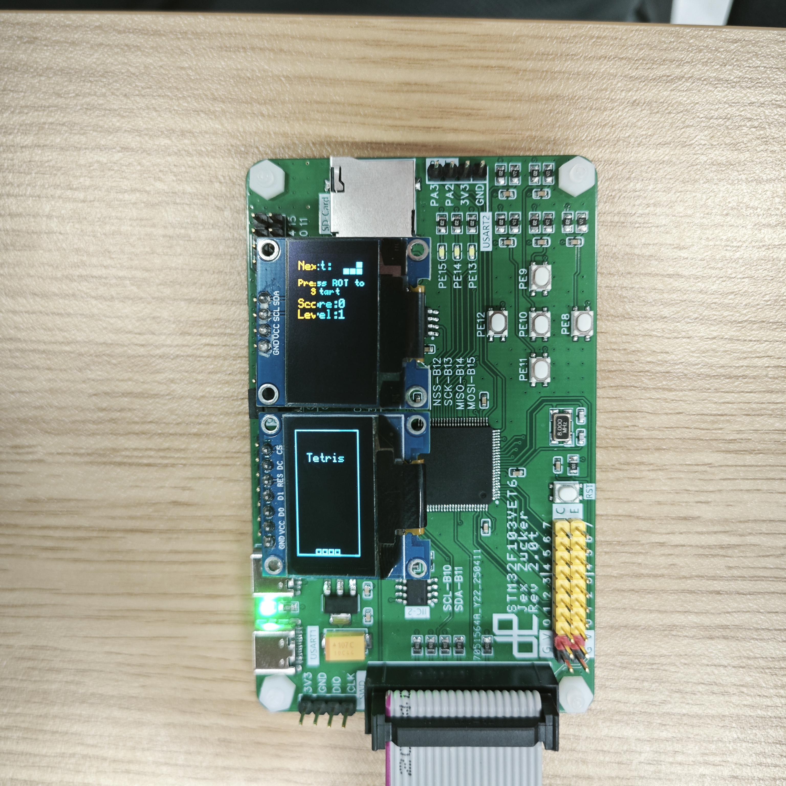

# Arduino 俄罗斯方块游戏

[English](README.md) | [中文](README_zh.md)

基于 Arduino 和 OLED 屏幕的经典俄罗斯方块实现，支持双屏显示（游戏主界面 + 信息面板），使用 STM32 开发板开发。

## 硬件需求

- STM32 开发板 (例如 ZLAB_F103VE)
- 128x64 SSD1306 OLED 屏幕 x2 (一个 SPI 接口 + 一个 I2C 接口)
- SD 卡模块 (SPI 接口)
- 无源蜂鸣器
- 5 个按键
- 连接详情:

  ```
  主屏幕 (SPI):
    CS  -> PA4
    DC  -> PB1
    RES -> PB0

  信息屏幕 (I2C):
    SCL -> PB6
    SDA -> PB7

  SD 卡:
    默认 SPI 引脚 (MOSI/MISO/SCK/CS)

  蜂鸣器:
    信号脚 -> PA8

  按键:
    左 (Left)   -> PE12
    右 (Right)  -> PE8
    下 (Down)   -> PE11
    上 (Up)     -> PE9
    旋转 (Rotate) -> PE10
  ```

## 软件依赖

- Arduino IDE 或 PlatformIO
- U8g2 库 (OLED 驱动)
- STM32SD 库 (SD 卡支持)

## 安装步骤

1. 克隆此仓库。
2. 安装 U8g2 和 STM32SD 库 (通过 Arduino 库管理器)。
3. 连接硬件设备。
4. 编译并上传代码到开发板。

## 操作说明

### 按键功能

- 左/右: 水平移动
- 下: 软降 (加速下落)
- 上: 硬降 (瞬间下落)
- 旋转键: 顺时针旋转
- 同时按下 左 + 右: 暂停，按旋转键恢复

### 游戏状态

- 启动画面: 按旋转键开始
- 游戏中: 显示当前方块和幽灵方块预览
- 暂停: 显示 PAUSE 消息
- 游戏结束: 显示 GAME OVER，按旋转键重试

## 游戏特性

- 完整的 SRS 旋转系统 (支持踢墙 Wall Kick)
- 幽灵方块预览
- 多级加速系统 (每消除 10 行升级一次)
- 计分系统:
  - 软降: 1 分/格
  - 硬降: 2 分/格
  - 消除行: 100 分/行 × 等级
- 7-bag 随机生成器
- 最高分保存 (保存至 SD 卡 `save.txt` 文件)
- 音效支持 (移动、旋转、下落、消行、游戏结束)
- 双屏显示:
  - 主屏幕: 游戏区域
  - 信息屏幕: 分数/最高分/等级/下一个方块

## 许可证

MIT License - 欢迎使用、修改和分发代码，但请保留版权声明。

## 已知限制

- 暂未实现暂存 (Hold) 功能
- 等级加速上限为 15 级

欢迎提交 Issues 和 Pull Requests!

## 截图

### 主屏幕


### 信息屏幕

